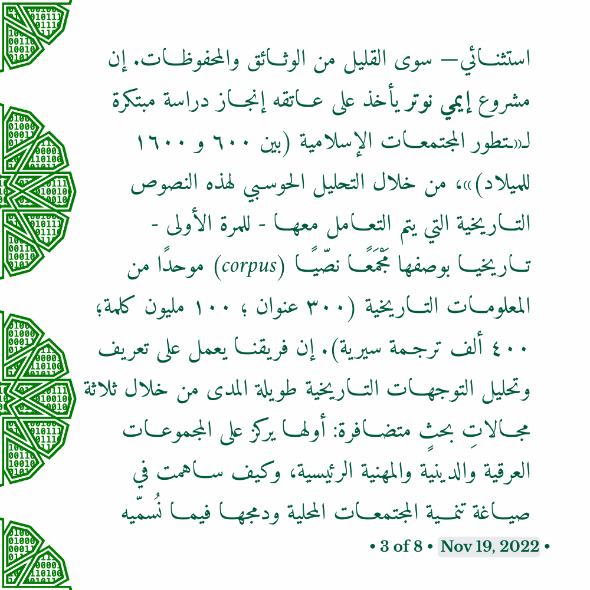
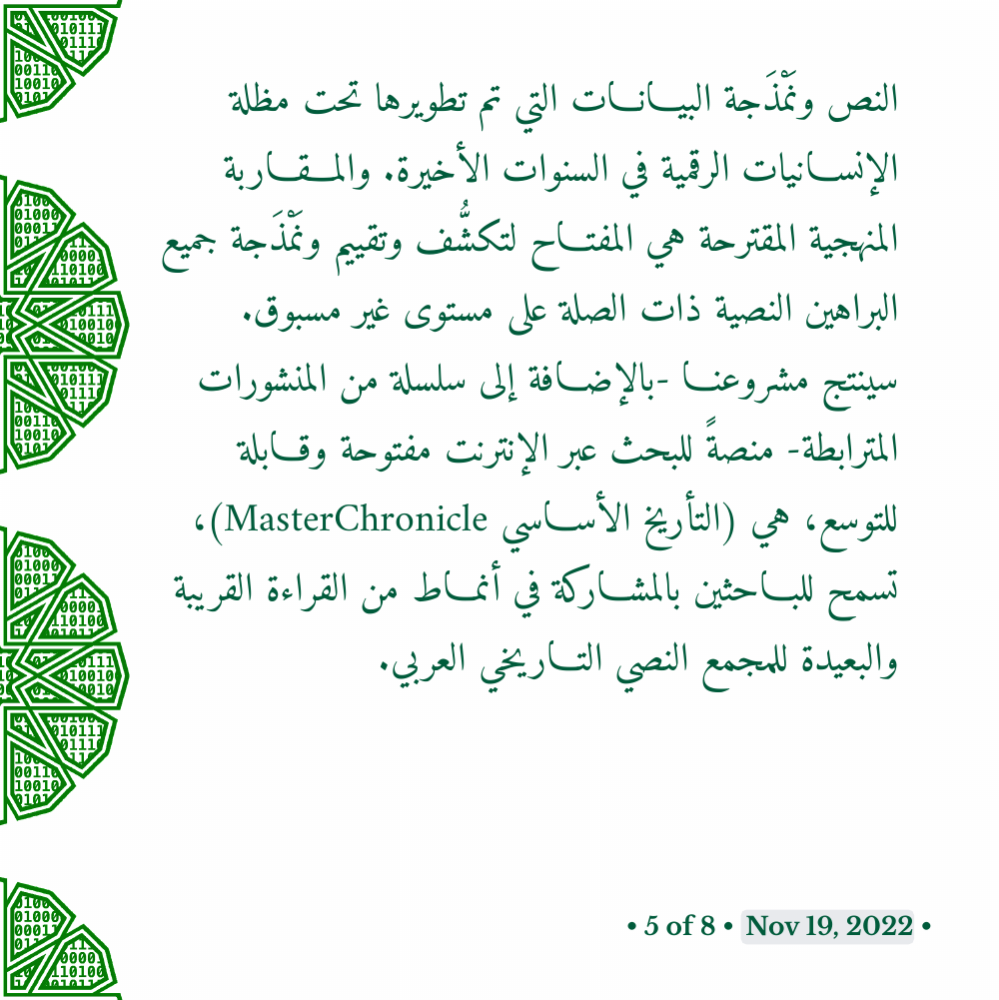
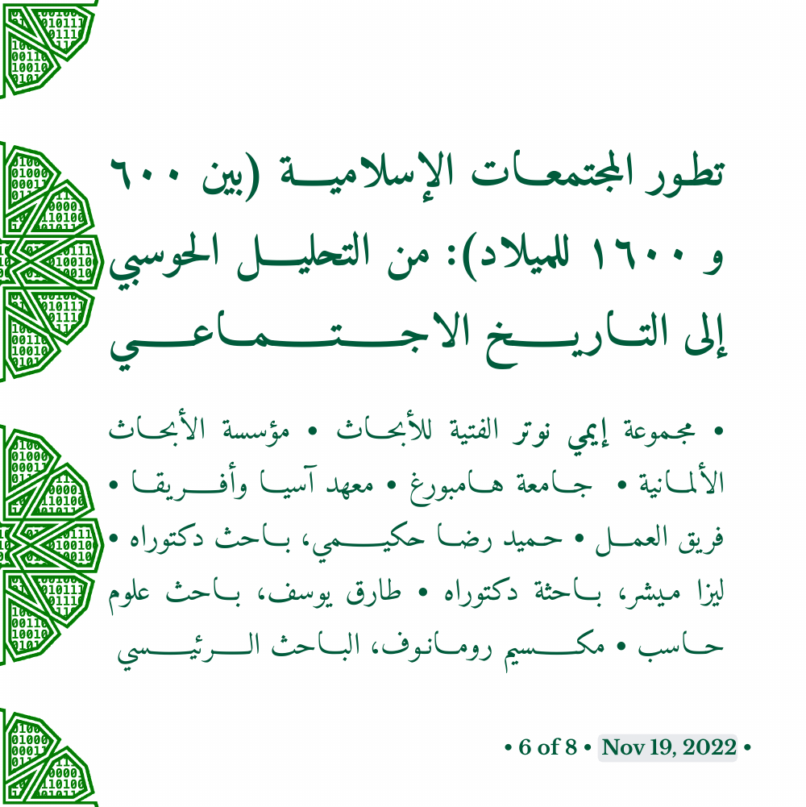

تطور المجتمع الإسلامي عبر مسار الألفية الأولى من تاريخه (بين ٦٠٠ و ١٦٠٠ للميلاد) من تكوين اجتماعي قبلي بسيط إلى كيان اجتماعي وثقافي وسياسي متعدد الأوجه امتد من الأندلس والمغرب الأقصى غربا، إلى الهند وما وراء النهر شرقا. وتحتفظ حوليات التاريخ والطبقات والسير العربية بفيضٍ من المعلومات حول التحولات البيئية والمجتمعية طويلة المدى التي شكّلت المجتمع الإسلامي خلال هذه الفترة من الزمن. وبوفْرتهِا وشمولِيّتها فإن هذه النصوص المكتوبة هي المنجم الأشدّ ثراءً للمعلومات. وهي ذات قيمة كبرى؛ خصوصًا فيما يتعلق بالفترة السابقة على القرن الخامس عشر الميلادي، والتي ليس متاحا منها —بشكل استثنائي— سوى القليل من الوثائق والمحفوظات. إن مشروع إيمي نوتر ([# ٤٤٥٩٧٥٣٠٠](https://gepris.dfg.de/gepris/projekt/445975300?language=en))  يأخذ على عاتقه إنجاز دراسة مبتكرة ل«تطور المجتمعات الإسلامية (بين ٦٠٠ و ١٦٠٠ للميلاد)»، من خلال التحليل الحوسبي لهذه النصوص التاريخية التي يتم التعامل معها - للمرة الأولى - تاريخيا بوصفها مَجْمَعًا نصّيًا (corpus) موحدًا من المعلومات التاريخية (٣٠٠ عنوان ؛ ١٠٠ مليون كلمة؛ ٤٠٠ ألف ترجمة سيرية). إن فريقنا يعمل على تعريف وتحليل التوجهات التاريخية طويلة المدى من خلال ثلاثة مجالاتِ بحثٍ متضافرة: أولها يركز على المجموعات العرقية والدينية والمهنية الرئيسية، وكيف ساهمت في صياغة تنمية المجتمعات المحلية ودمجها فيما نُسمّيه العالمَ الإسلامي. ويركز الثاني على الأسر الحاكمة، من خلال أنماط ازدهار وانحدار القوى الإقليمية، وصراعاتها مع المنافسين، وتفاعلاتها مع المجتمعات المحلية. والثالث: يتعقّب أنماط العوامل البيئية؛ مثل الأوبئة، والمجاعات، والجفاف، وتفشي الآفات، والزلازل، وتغير المناخ..، وتأثيرها على حياة المجتمعات المحلية. إن دراسات الحالة هذه —بتضافرها وتكاملها— ستشكل أساسًا لتأليف سليم لتطور العالم الإسلامي خلال الفترة محل الدراسة. وللتغلب على التعقيد والحجم الهائل للمصادر التاريخية العربية في العصور الوسطى، وكذلك لتحليلها بطريقة فعالة وقابلة للتكرار؛ يستخدم مشروعنا سلسلة من المنهجيات الحوسبية المتقدمة لتحليل النص ونَمْذَجة البيانات التي تم تطويرها تحت مظلة الإنسانيات الرقمية في السنوات الأخيرة. والمقاربة المنهجية المقترحة هي المفتاح لتكشُّف وتقييم ونَمْذَجة جميع البراهين النصية ذات الصلة على مستوى غير مسبوق. 	سينتج مشروعنا -بالإضافة إلى سلسلة من المنشورات المترابطة- منصةً للبحث عبر الإنترنت مفتوحة وقابلة للتوسع، هي (التأريخ الأساسي MasterChronicle)، تسمح للباحثين بالمشاركة في أنماط من القراءة القريبة والبعيدة للمجمع النصي التاريخي العربي.

