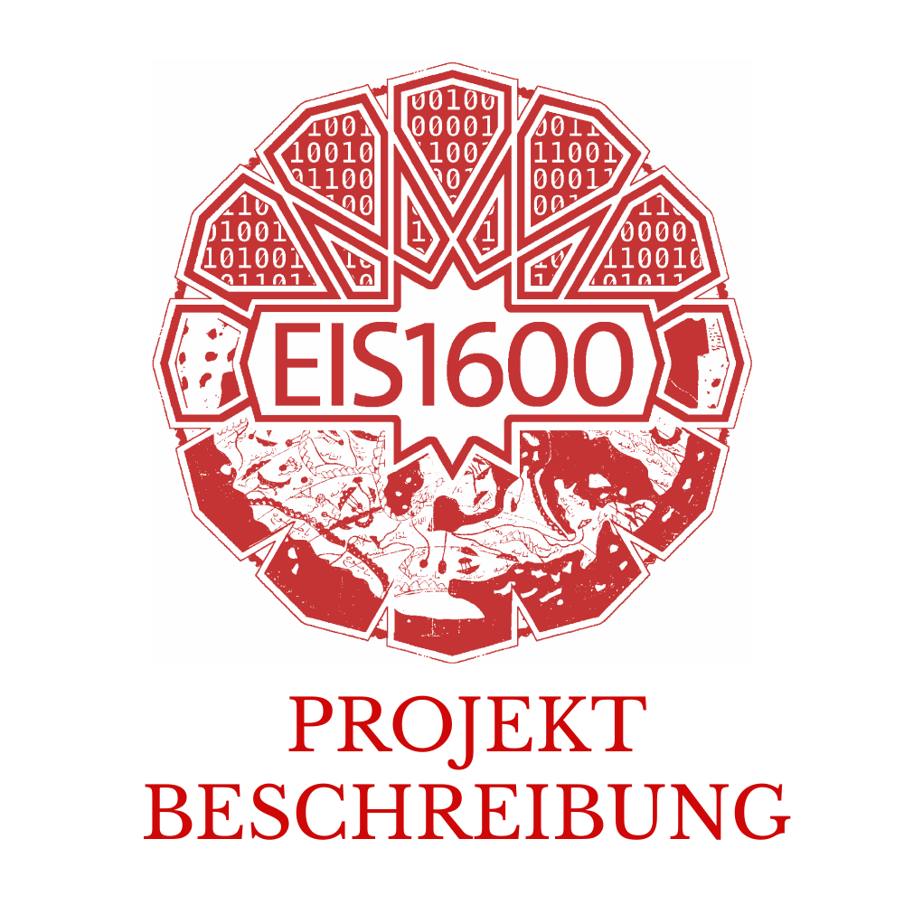
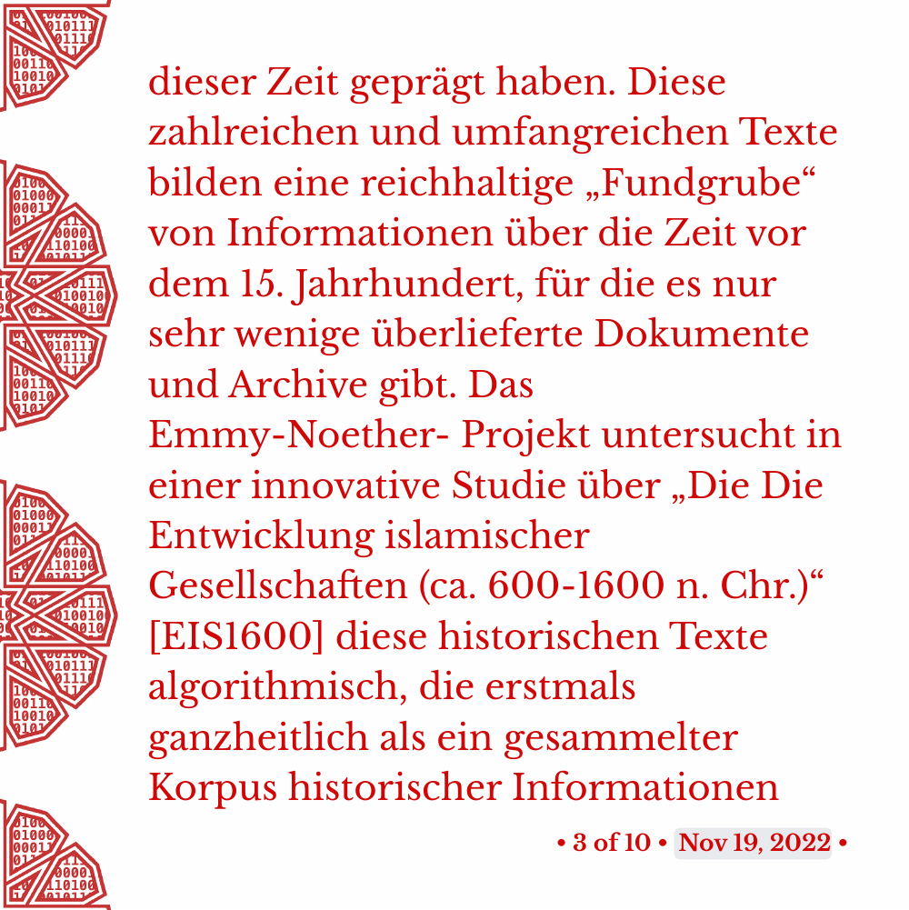
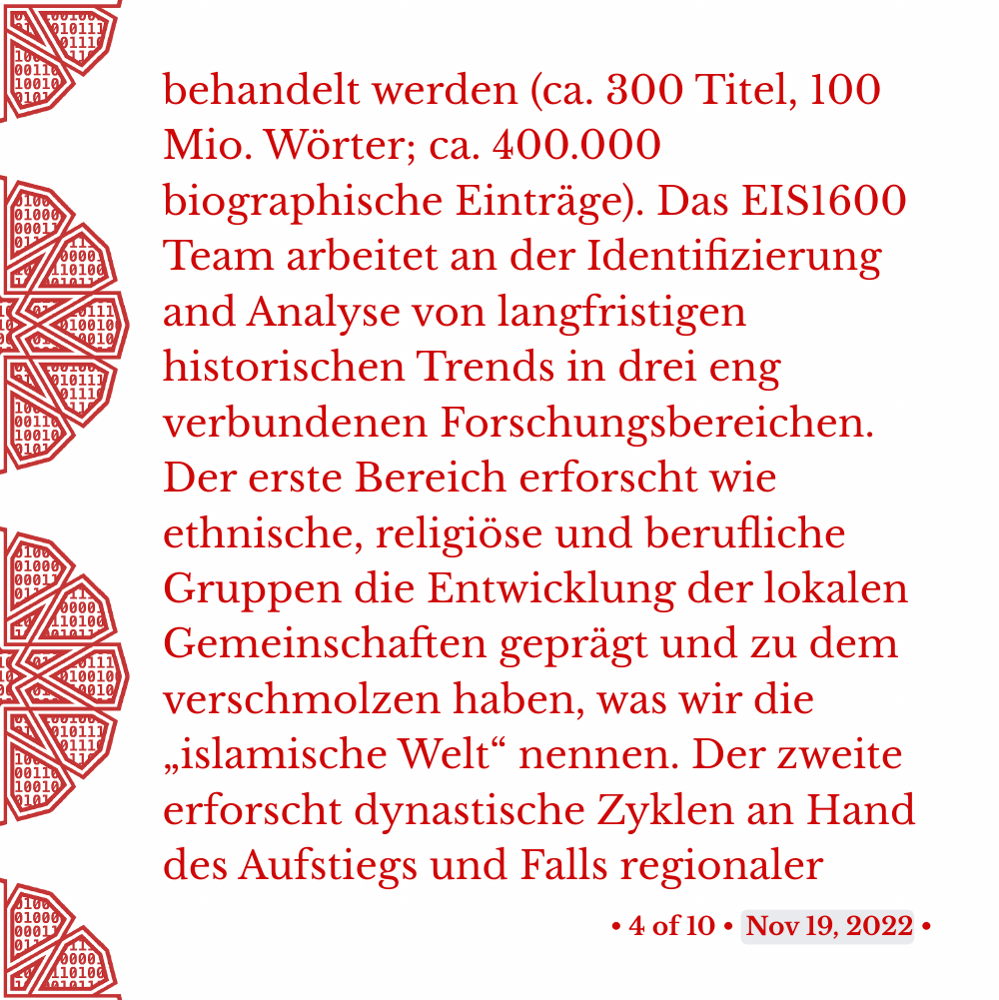
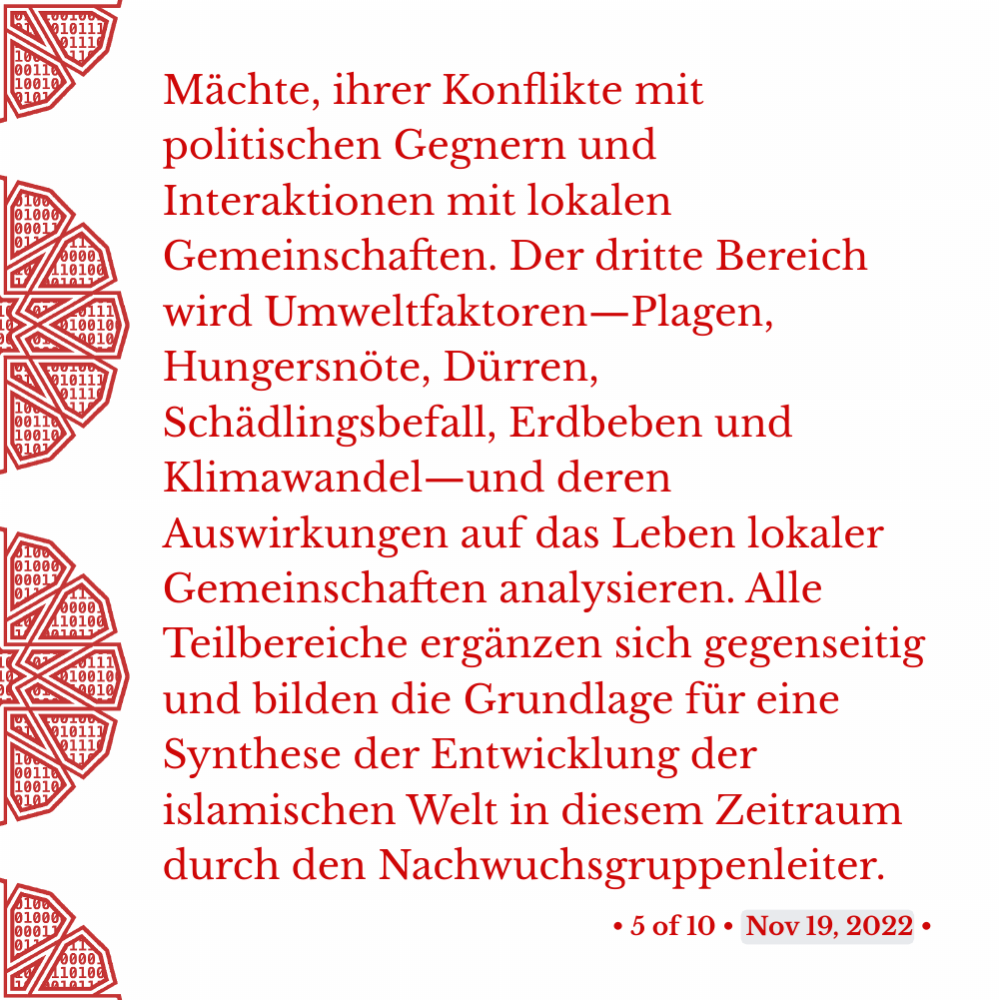
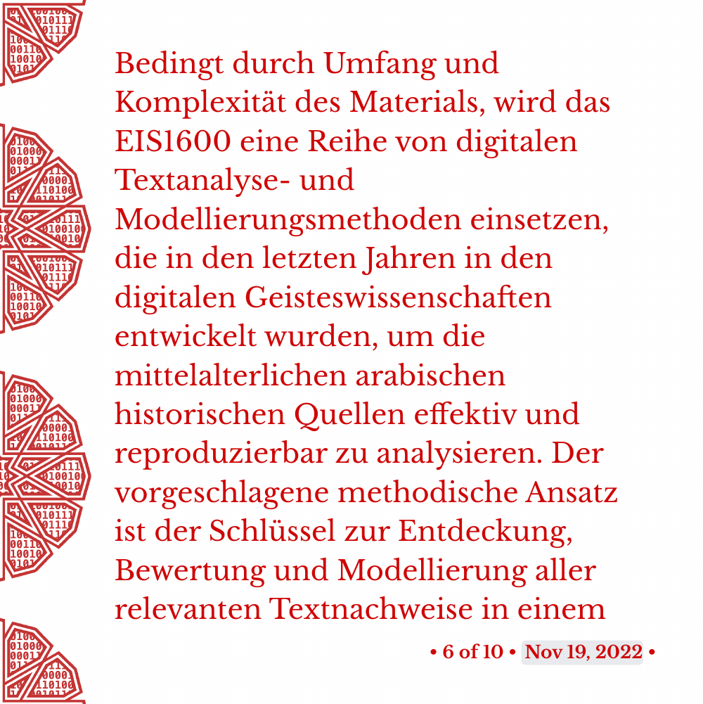

Im ersten Jahrtausend ihrer Geschichte (ca. 600–1600 n. Chr.) entwickelte sich die islamische Gesellschaft von einem einfachen Stammeswesen zu einem facettenreichen sozialen, kulturellen und politischen Gebilde, das sich von Spanien und Nordafrika bis Zentralasien und Indien erstreckte. Arabische Chroniken und biographische Sammlungen bewahren eine Fülle an Informationen über langfristige umweltbedingte und gesellschaftliche Prozesse, die die islamische Gesellschaft im Laufe dieser Zeit geprägt haben. Diese zahlreichen und umfangreichen Texte bilden eine reichhaltige „Fundgrube“ von Informationen über die Zeit vor dem 15. Jahrhundert, für die es nur sehr wenige überlieferte Dokumente und Archive gibt. Das Emmy-Noether-Projekt ([#445975300](https://gepris.dfg.de/gepris/projekt/445975300?language=en)) wird in einer innovative Studie über „Die Entwicklung islamischer Gesellschaften (ca. 600-1600 n. Chr.)“ [EIS1600] diese historischen Texte, die erstmals ganzheitlich als ein gesammelter Korpus historischer Informationen behandelt werden (ca. 300 Titel, 100 Mio. Wörter; ca. 400.000 biographische Einträge), algorithmisch untersuchen.

Das EIS1600 Team arbeitet an der Identifizierung and Analyse von langfristigen historischen Trends in drei eng verbundenen Forschungsbereichen. Der erste Bereich erforscht wie ethnische, religiöse und berufliche Gruppen die Entwicklung der lokalen Gemeinschaften geprägt und zu dem verschmolzen haben, was wir die „islamische Welt“ nennen. Der zweite erforscht dynastische Zyklen an Hand des Aufstiegs und Falls regionaler Mächte, ihrer Konflikte mit politischen Gegnern und Interaktionen mit lokalen Gemeinschaften. Der dritte Bereich wird Umweltfaktoren—Plagen, Hungersnöte, Dürren, Schädlingsbefall, Erdbeben und Klimawandel—und deren Auswirkungen auf das Leben lokaler Gemeinschaften analysieren. Alle Teilbereiche ergänzen sich gegenseitig und bilden die Grundlage für eine Synthese der Entwicklung der islamischen Welt in diesem Zeitraum durch den PI.

Bedingt durch Umfang und Komplexität des Materials, wird das EIS1600 eine Reihe von digitalen Textanalyse- und Modellierungsmethoden einsetzen, die in den letzten Jahren in den digitalen Geisteswissenschaften entwickelt wurden, um die mittelalterlichen arabischen historischen Quellen effektiv und reproduzierbar zu analysieren. Der vorgeschlagene methodische Ansatz ist der Schlüssel zur Entdeckung, Bewertung und Modellierung aller relevanten Textnachweise in einem bisher nicht gekannten Ausmaß. Neben einer Reihe von Publikationen soll eine offene und erweiterbare Online-Forschungsumgebung, MasterChronicle, entwickelt werden, die es Forschenden durch verschiedene Formen des „Close“ und „Distant Reading“ ermöglichen wird, sich in das arabische historische Korpus zu vertiefen.

