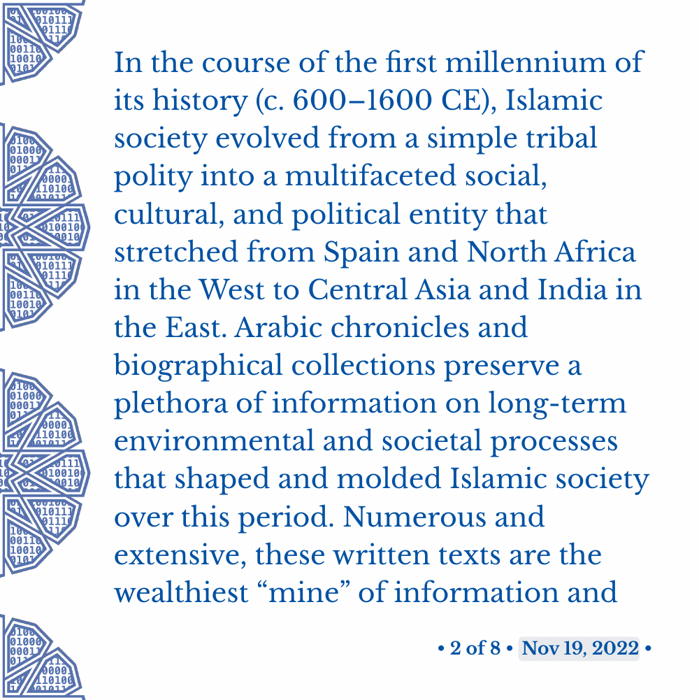
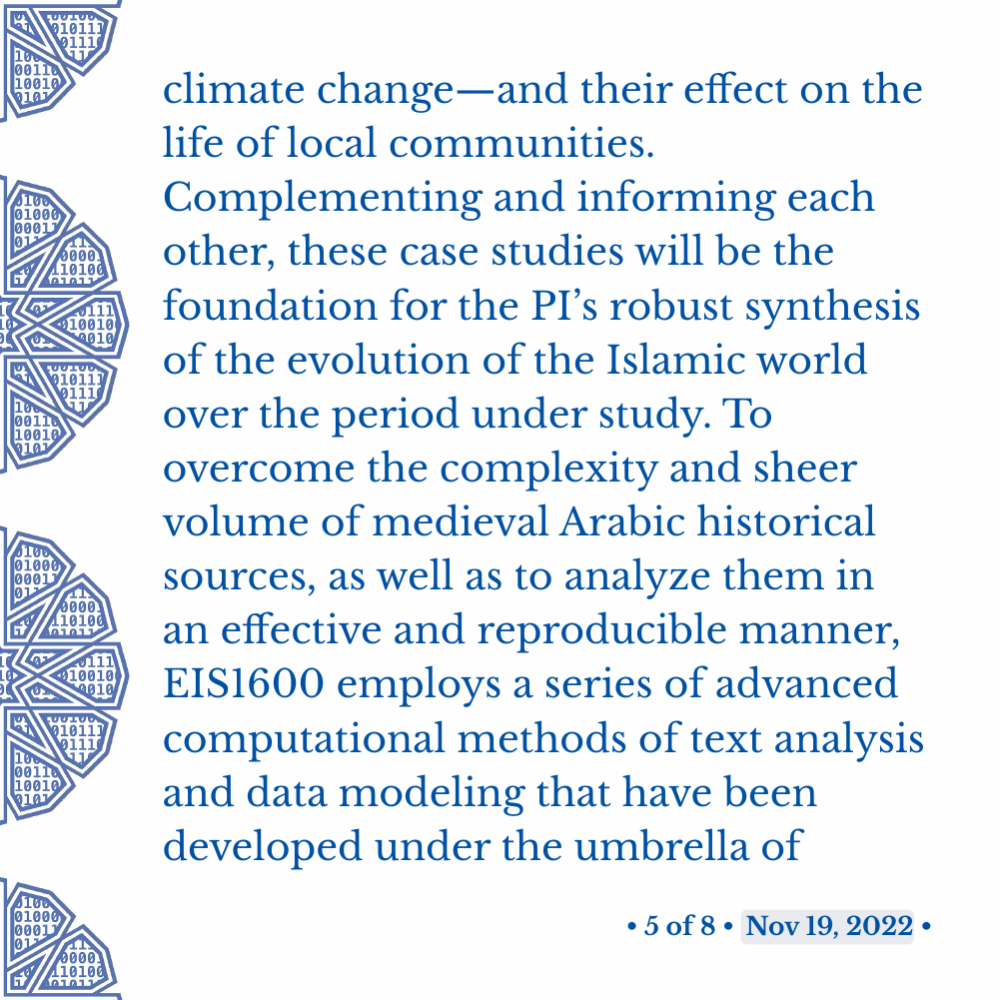
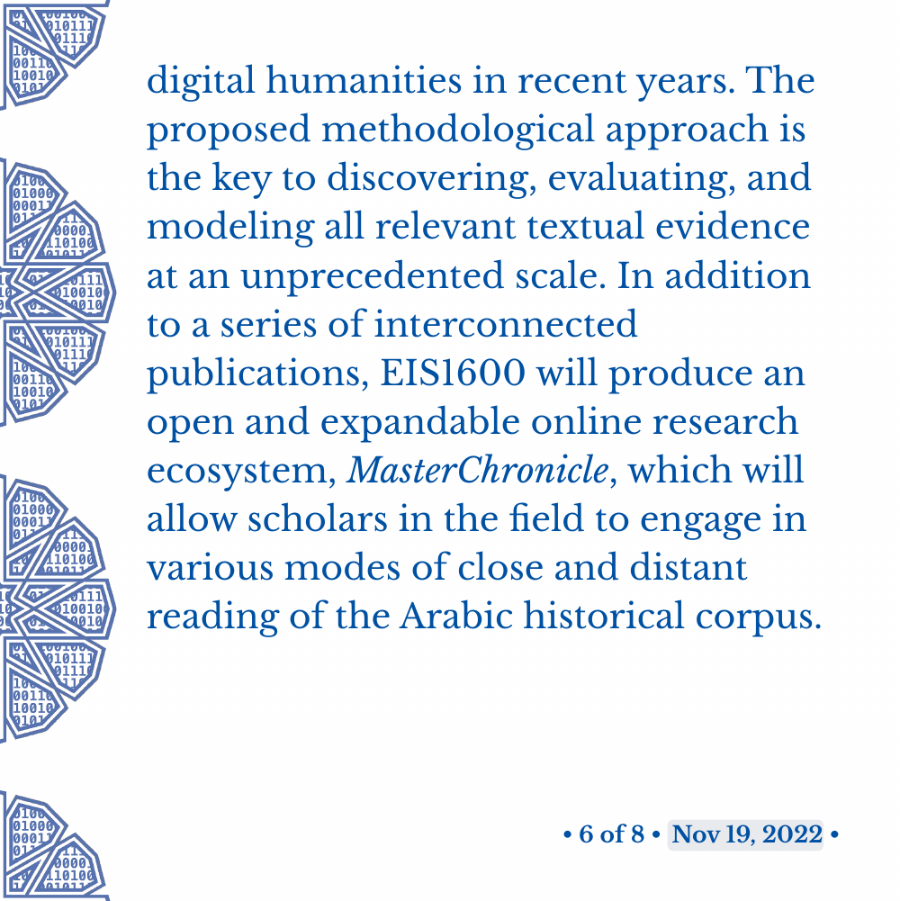
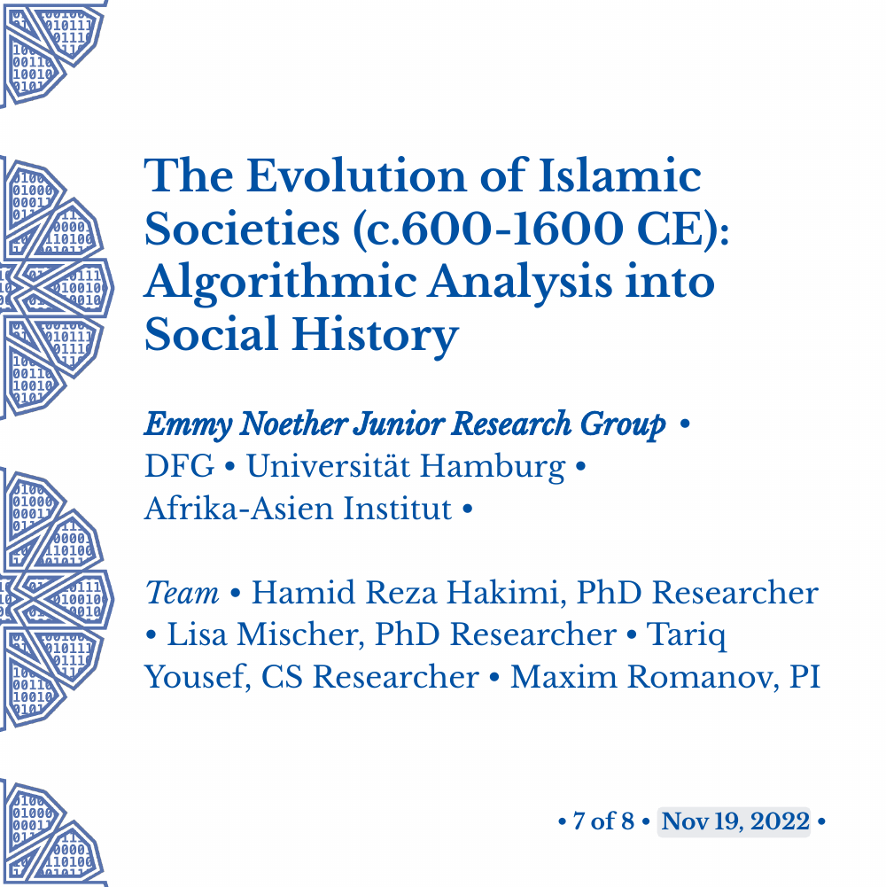
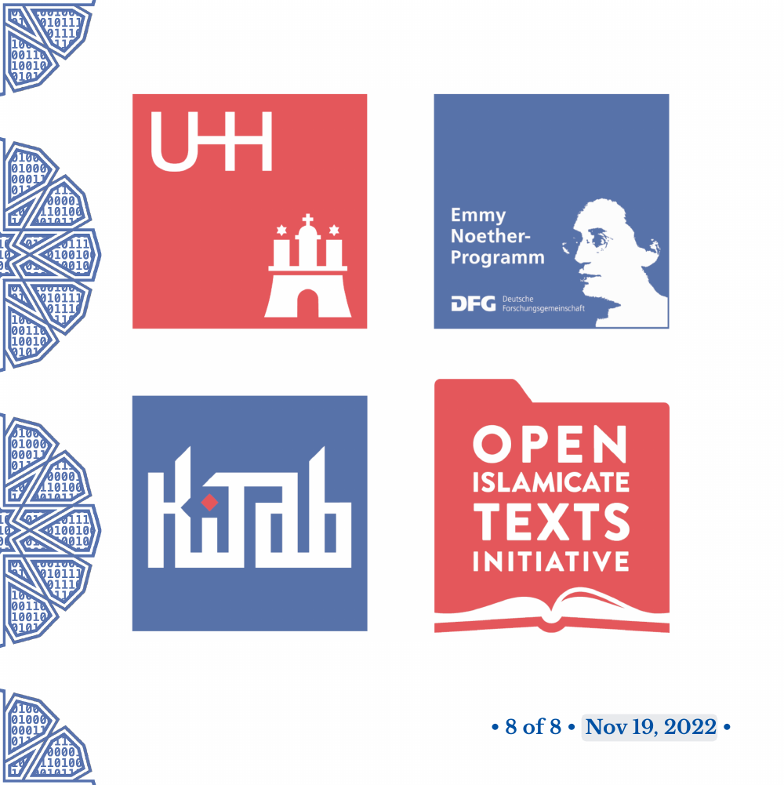

In the course of the first millennium of its history (c. 600–1600 CE), Islamic society evolved from a simple tribal polity into a multifaceted social, cultural, and political entity that stretched from Spain and North Africa in the West to Central Asia and India in the East. Arabic chronicles and biographical collections preserve a plethora of information on long-term environmental and societal processes that shaped and molded Islamic society over this period. Numerous and extensive, these written texts are the wealthiest “mine” of information and are particularly valuable for the period before the 15th century, for which exceptionally few documents and archives are available. The Emmy-Noether Project ([#445975300](https://gepris.dfg.de/gepris/projekt/445975300?language=en)) undertakes an innovative study of “The Evolution of Islamic Societies (c. 600-1600 CE)” [EIS1600] through the computational analysis of these historical texts, which—for the first time—are treated holistically as a unified corpus of historical information (c. 300 titles; 100 million words; c. 400,000 biographical records).

The EIS1600 team works on identifying and analyzing long-term historical trends through three closely connected research areas. The first area focuses on major ethnic, religious, and professional groups—and how they shaped the development of local communities and fused them into what we call the Islamic world. The second one focuses on dynastic cycles through the patterns of the rise and fall of regional powers, their conflicts with rivals, and interactions with local communities. The third one traces patterns of environmental factors—plagues, famines, droughts, pest infestations, earthquakes, and climate change—and their effect on the life of local communities. Complementing and informing each other, these case studies will be the foundation for the PI’s robust synthesis of the evolution of the Islamic world over the period under study.

To overcome the complexity and sheer volume of medieval Arabic historical sources, as well as to analyze them in an effective and reproducible manner, EIS1600 employs a series of advanced computational methods of text analysis and data modeling that have been developed under the umbrella of digital humanities in recent years. The proposed methodological approach is the key to discovering, evaluating, and modeling all relevant textual evidence at an unprecedented scale. In addition to a series of interconnected publications, EIS1600 will produce an open and expandable online research ecosystem, MasterChronicle, which will allow scholars in the field to engage in various modes of close and distant reading of the Arabic historical corpus.

