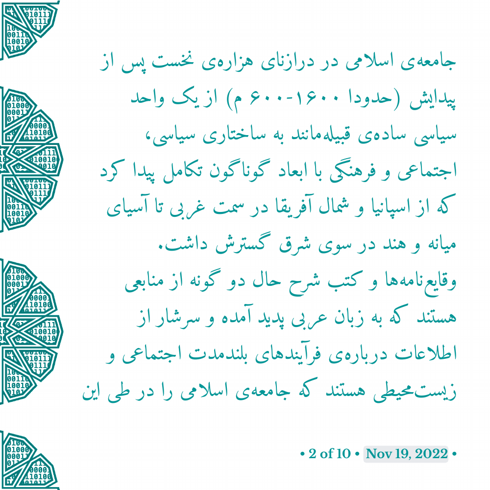
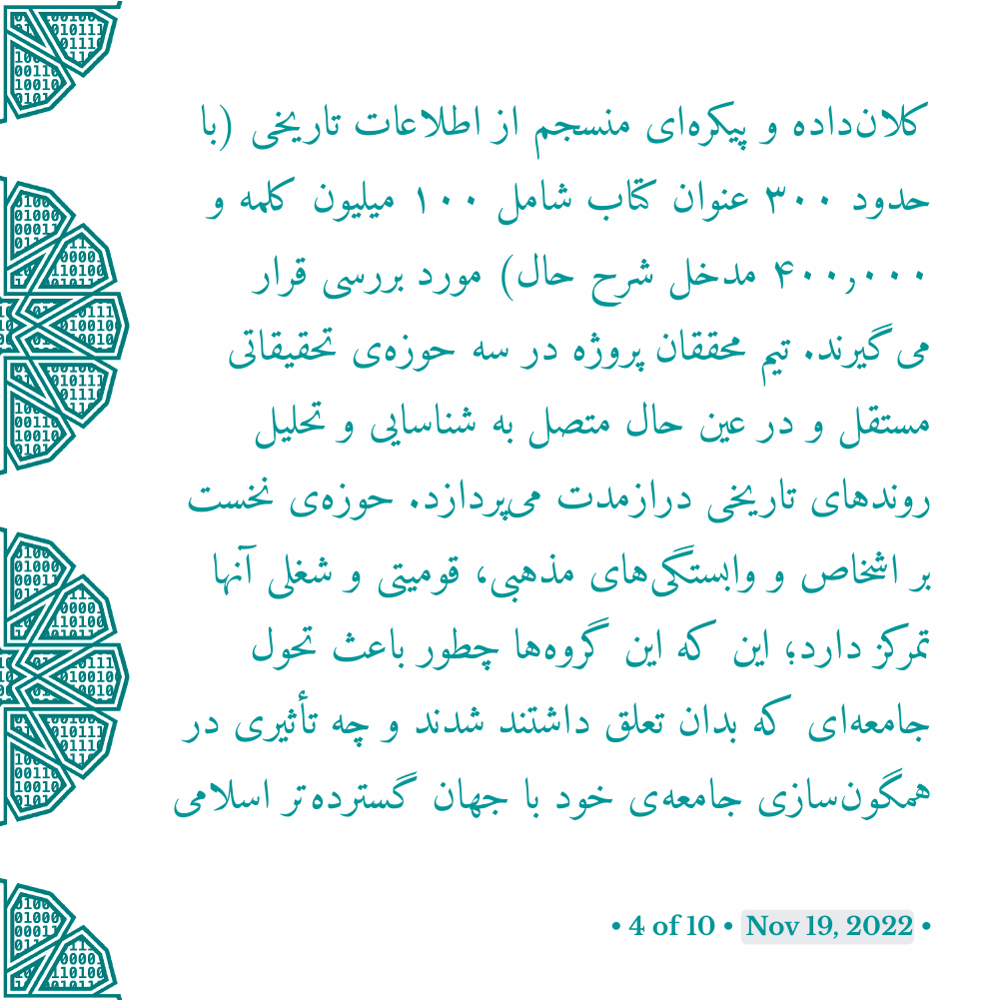
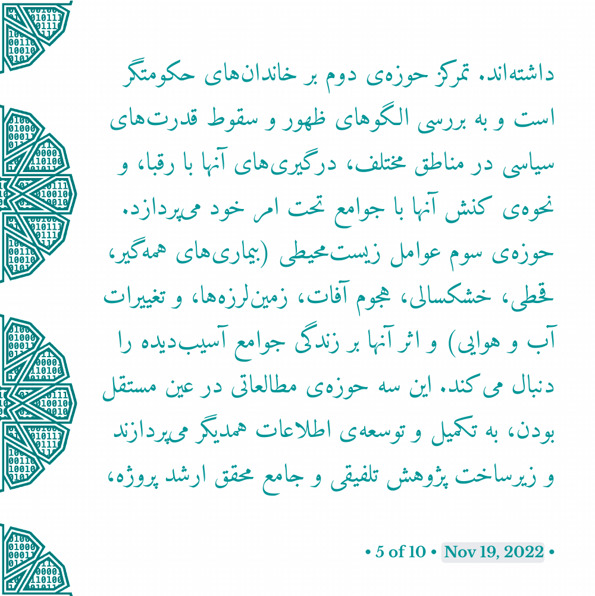
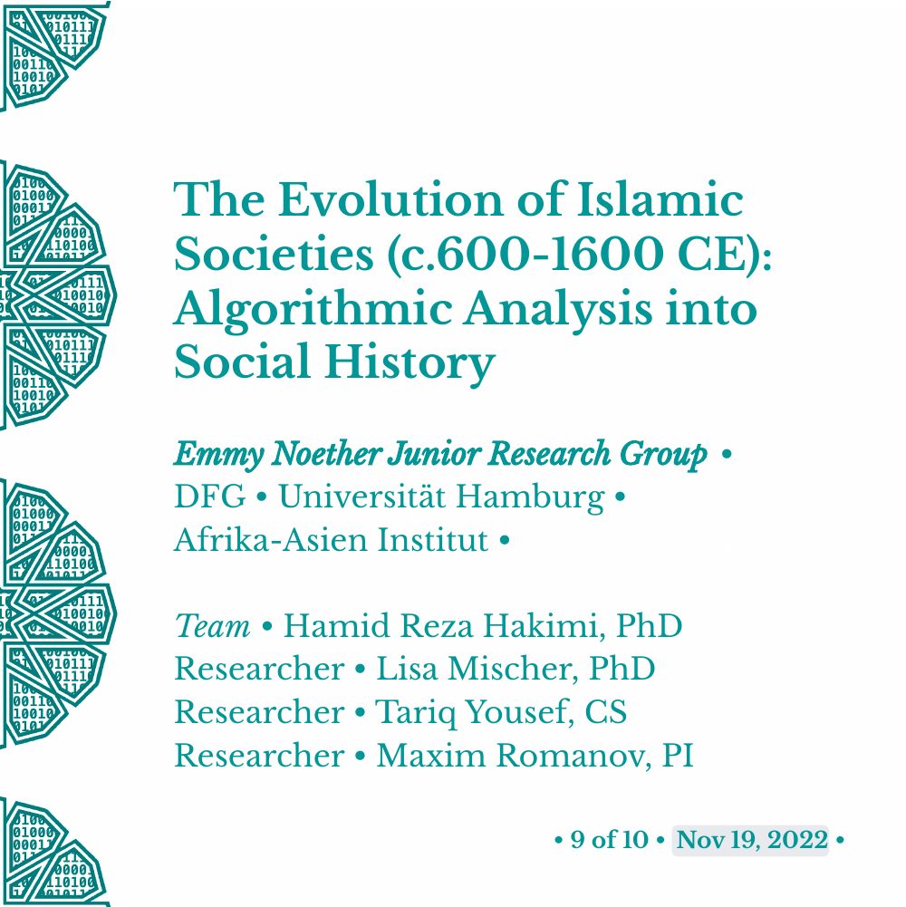

جامعه‌ی اسلامی در درازنای هزاره‌ی نخست پس از پیدایش (حدودا ۱۶۰۰-۶۰۰ م) از یک واحد سیاسی ساده‌ی قبیله‌مانند به ساختاری سیاسی، اجتماعی و فرهنگی با ابعاد گوناگون تکامل پیدا کرد که از اسپانیا و شمال آفریقا در سمت غربی تا آسیای میانه و هند در سوی شرق گسترش داشت. وقایع‌نامه‌ها و کتب شرح حال دو گونه از منابعی هستند که به زبان عربی پدید آمده و سرشار از اطلاعات درباره‌ی فرآیندهای بلندمدت اجتماعی و زیست‌محیطی هستند که جامعه‌ی اسلامی را در طی این دوره شکل داده و متحول کرده‌اند. این دو گونه متن که بسیار پرشمار و حجیم هستند را باید غنی‌ترین منابع برای استخراج اطلاعات به حساب آورد؛ به‌ویژه برای دوره‌ی زمانی پیش از سده‌ی پانزدهم میلادی که بایگانی‌ها و اسناد به‌جای‌مانده از آن فوق‌العاده اندک است. این پروژه که در چارچوب برنامه‌ی امی-نوتر ([# ۴۴۵۹۷۵۳۰۰](https://gepris.dfg.de/gepris/projekt/445975300?language=en)) برای حمایت از علوم انسانی به فعالیت می‌پردازد، قصد دارد با تحلیل رایانه‌ای این دو گونه منبع تاریخی، «تکامل جوامع اسلامی (۱۶۰۰-۶۰۰ م)» را بررسی نماید. در این پروژه، این منابع برای اولین بار به عنوان کلان‌داده و پیکره‌ای منسجم از اطلاعات تاریخی (با حدود ۳۰۰ عنوان کتاب شامل ۱۰۰ میلیون کلمه و ۴۰۰٫۰۰۰ مدخل شرح حال) مورد بررسی قرار می‌گیرند. تیم محققان پروژه در سه حوزه‌ی تحقیقاتی مستقل و در عین حال متصل به شناسایی و تحلیل روندهای تاریخی درازمدت می‌پردازد. حوزه‌ی نخست بر اشخاص و وابستگی‌های مذهبی، قومیتی و شغلی آنها تمرکز دارد؛ این که این گروه‌ها چطور باعث تحول جامعه‌ای که بدان تعلق داشتند شدند و چه تأثیری در همگون‌سازی جامعه‌ی خود با جهان گسترده‌تر اسلامی داشته‌اند. تمرکز حوزه‌ی دوم بر خاندان‌های حکومتگر است و به بررسی الگوهای ظهور و سقوط قدرت‌های سیاسی در مناطق مختلف، درگیری‌های آنها با رقبا، و نحوه‌ی کنش آنها با جوامع تحت امر خود می‌پردازد. حوزه‌ی سوم عوامل زیست‌محیطی (بیماری‌های همه‌گیر، قحطی، خشکسالی، هجوم آفات، زمین‌لرزه‌ها، و تغییرات آب و هوایی) و اثر آنها بر زندگی جوامع آسیب‌دیده را دنبال می‌کند. این سه حوزه‌ی مطالعاتی در عین مستقل بودن، به تکمیل و توسعه‌ی اطلاعات همدیگر می‌پردازند و زیرساخت پژوهش تلفیقی و جامع محقق ارشد پروژه، دکتر ماکسیم رومانوف، درباره‌ی تکامل جهان اسلامی در دوره‌ی مورد بحث را شکل خواهند داد. برای غلبه بر مشکل پیچیدگی و حجم بسیار زیاد اطلاعات موجود در متون تاریخی عربی و همچنین به منظور تحلیل این متون به شکلی مؤثر و برخوردار از قابلیت بازتولید داده‌ها، انواعی از روش‌های کامپیوتری تحلیل متن و مدلسازی داده‌ها که در سال‌های اخیر در حوزه‌ی علوم انسانی دیجیتال پدید آمده‌اند در این پروژه مورد استفاده قرار می‌گیرند. چنین چارچوب روش‌شناختی، شالوده‌ای برای جستجو، ارزیابی و مدلسازی همه‌ی شواهد متنی در مقیاسی بی‌سابقه خواهد بود. علاوه بر انتشار رشته‌ای از تحقیقات مرتبط، خروجی پروژه همچنین شامل توسعه‌ی یک محیط تحقیقاتی آنلاین و گسترش‌پذیر تحت عنوان «اَبَررویدادنامه» خواهد بود تا این امکان را برای محققان حوزه‌های گوناگون مرتبط با جهان اسلامی فراهم سازد که به شیوه‌های گوناگون به مطالعه‌ی کلان‌مقیاس یا خُردمقیاس چنین پیکره‌ای از متون تاریخی عربی بپردازند.

