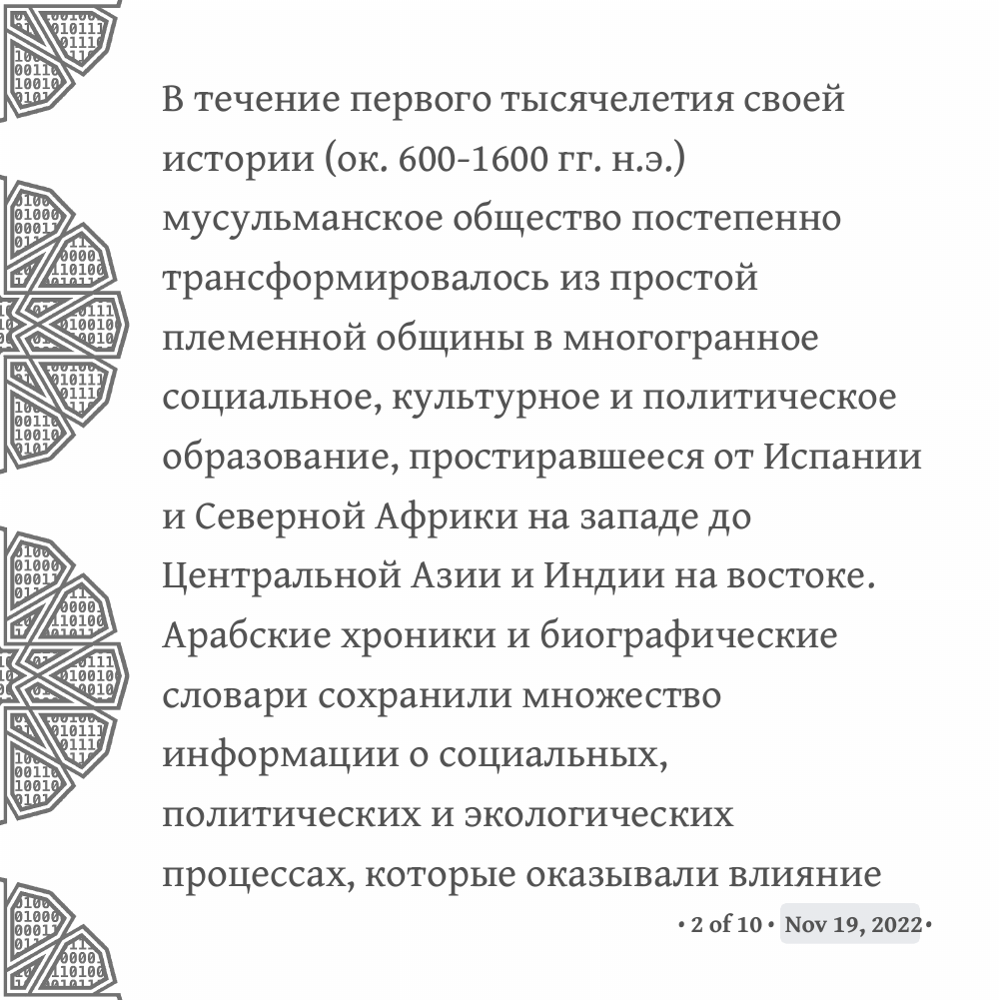
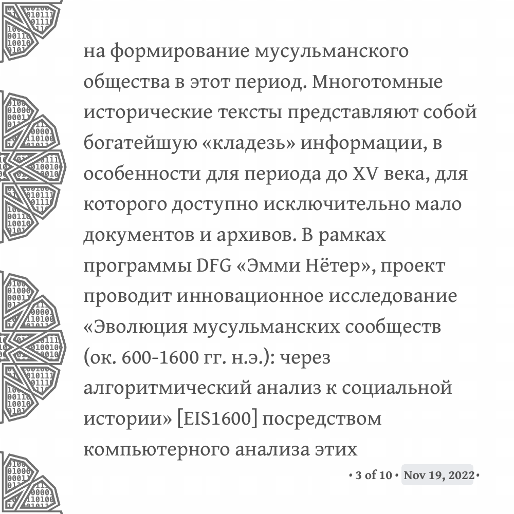
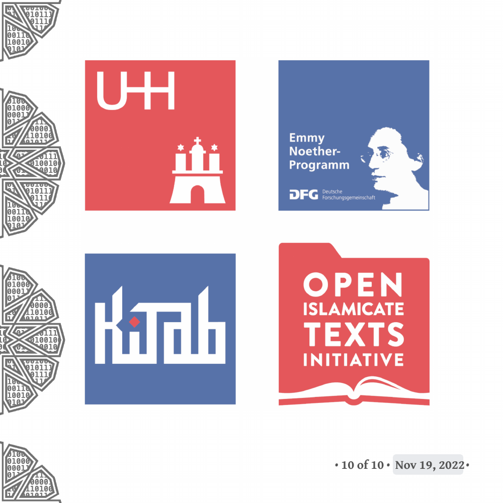

В течение первого тысячелетия своей истории (ок. 600-1600 гг. н.э.) мусульманское общество постепенно трансформировалось из простой племенной общины в многогранное социальное, культурное и политическое образование, простиравшееся от Испании и Северной Африки на западе до Центральной Азии и Индии на востоке. Арабские хроники и биографические словари сохранили множество информации о социальных, политических и экологических процессах, которые оказывали влияние на формирование мусульманского общества в этот период. Многотомные исторические тексты представляют собой богатейшую «кладезь» информации, в особенности для периода до 15 века, для которого доступно исключительно мало документов и архивов. В рамках программы DFG «Эмми Нётер» ([№445975300](https://gepris.dfg.de/gepris/projekt/445975300?language=en)), проект проводит инновационное исследование «Эволюция мусульманских сообществ (ок. 600-1600 гг. н.э.): через алгоритмический анализ к социальной истории» [EIS1600] посредством компьютерного анализа этих исторических текстов, которые впервые будут рассматриваться целостно, как единый корпус исторической информации (ок. 300 источников; 100 миллионов слов; ок. 400,000 биографий).

Исследователи проекта работают над выявлением и анализом долгосрочных исторических тенденций в рамках трех тематических направлений. Первое изучает основные этнические, религиозные и профессиональные группы—как они влияли на развитие местных общин и объединяли их в то, что мы называем мусульманским миром. Второе изучает династические циклы путем моделирования взлетов и падений местных правителей, их конфликтов с соперниками и взаимодействие с местными общинами. Третье прослеживает закономерности экологических факторов—чума, голод, засухи, нашествия вредителей, землетрясения и изменения климата—и их влияние на жизнь местных общин. Дополняя и информируя друг друга, исследования в рамках этих тематических направлений станут основой синтеза развития мусульманского мира в изучаемый период.

Для эффективного и воспроизводимого анализа огромного объема средневековых арабских исторических источников, проект полагается на ряд передовых вычислительных методов анализа текстов и моделирования данных, которые были разработаны в последние годы в рамках «цифровой гуманистики». Предлагаемый методологический подход станет ключом к обнаружению, оценке и моделированию всей релевантной информации на беспрецедентном уровне. В проекте планируется серия публикаций, а также расширяемая исследовательская платформа, MasterChronicle, которая позволит исследователям в данной области заниматься различными видами «пристального» и «дальнего» чтения арабских исторических текстов.

